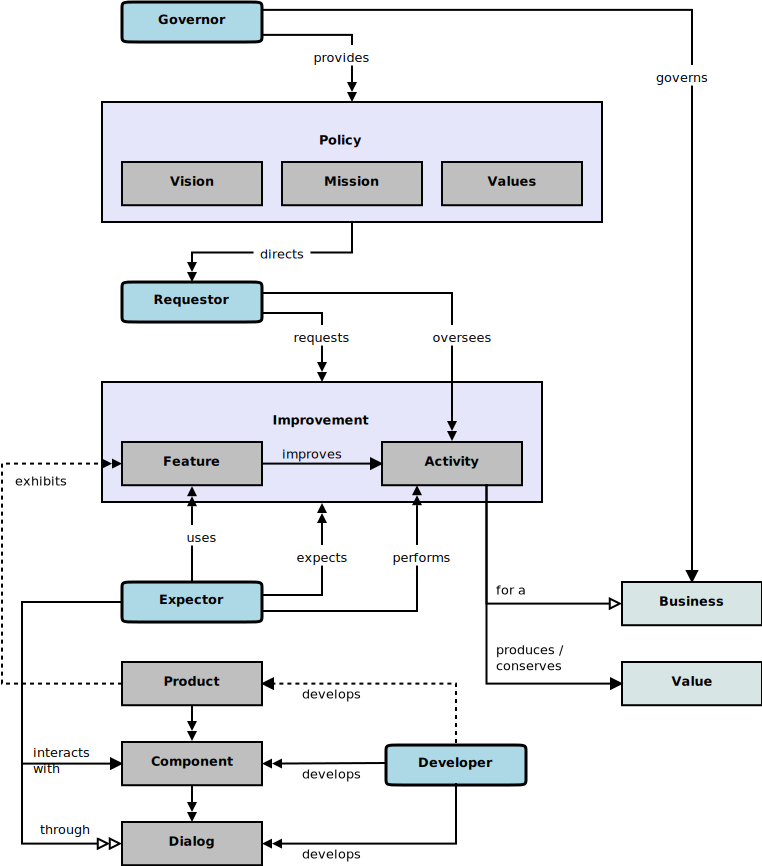

### A Conceptual Model for Software Requirements

This conceptual model is a small sample derived from that described more fully [here][model]. 
See the [build instructions](BUILDME.md) to rebuild the associated model site and [domain inventory][inventory].

Most of the pages and diagrams included in this site were generated automatically from the sample 
[domain model][sample-domain] referenced by [Syntopica][syntopica-tool], a companion conceptual modeling tool.
The accompanying [domain inventory][inventory] was also generated automatically.
The following [overview](#overview) was added manually.

These results intend to show what can be accomplished with [syntopica][syntopica-tool] and the [EDUCE][educe] process.
Because EDUCE is a process of incremental discovery and capture of facts, it warrants automation support.

### Overview

[Vision][vision], [mission][mission], and [values][value] articulate
the intended ends of a business and the acceptable means for reaching those
ends. [Purposes][purpose] align business [activities][activity] with the business 
[mission][mission] and [vision][vision]. Business [activities][activity] fulfill a business
[purpose][purpose] and further a business towards its objectives. 
Business [activities][activity] often have opportunities for (measurable) [improvements][improvement].

Software [solution][solution] [features][feature] support and improve business [activities][activity].
[Dialogs][dialog] reveal [solution][solution] [features][feature] and domain information models. 
Software [components][component] surface [dialogs][dialog] and conduct conversations with software
[solution][solution] [users][user]. 
[Solution][solution] requirements knowledge and descriptions originate with some official (or unofficial) 
[sources][source].

The relationships between [stakeholders][stakeholder], [sources][source], 
and their knowledge can be modeled and depicted graphically with a natural conceptual model. 
The following diagram shows selected, representative portions of such a natural conceptual model. 
A key to the notation used in this model diagram can be found in [Appendix A][notation] of the [full article][model].
Descriptions of the essential model elements can be found in the linked pages through the foregoing textual hyperlinks.

[sample-domain]: briefs/domain-facts.txt#L1
[activity]: topics/activity.md
[component]: topics/component.md
[dialog]: topics/dialog.md
[expector]: topics/expector.md
[feature]: topics/feature.md
[improvement]: topics/improvement.md
[mission]: topics/mission.md
[purpose]: topics/purpose.md
[solution]: topics/solution.md
[source]: topics/source.md
[stakeholder]: topics/stakeholder.md
[user]: topics/user.md
[value]: topics/value.md
[vision]: topics/vision.md

[syntopica-tool]: https://github.com/nikboyd/syntopica/#syntopica
[model]: https://educery.dev/papers/software-requirements/#conceptual-model
[inventory]: domain-inventory.md#software-requirements-domain-inventory
[notation]: https://educery.dev/papers/software-requirements/#model-key
[educe]: https://educery.dev/educe/
