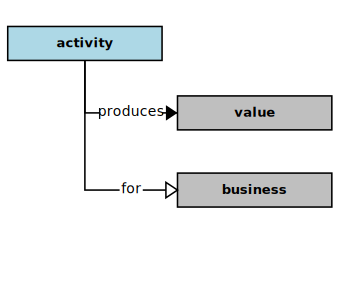

## Activity

In the context of this [model](../domain-inventory.md), an [activity][activity]

<ul>
 <li><i>produces</i> a <a href="value.md">value</a> for a <a href="business.md">business</a></li>
 <li> </li>
 <li> </li>
 <li> </li>
 <li> </li>
 <li> </li>
 <li> </li>
 <li> </li>
 <li> </li>
 <li> </li>
 <li> </li>
 <li> </li>
 <li> </li>
</ul>

<ul>
 <li><i>conserves</i> a <a href="value.md">value</a> for a <a href="business.md">business</a></li>
 <li> </li>
 <li> </li>
 <li> </li>
 <li> </li>
 <li> </li>
 <li> </li>
 <li> </li>
 <li> </li>
 <li> </li>
 <li> </li>
 <li> </li>
 <li> </li>
</ul>

### Discussion

A [business][business] accomplishes its [mission][mission] in the world through its [activities][activity].
And, its [activities][activity] need to be kept in alignment with its purposes.
So, the [qualities][qualities] associated with those [activities][activity]
warrant [measurement][measurement] in order to manage and [improve][improve] their conduct.

The [activities][activity] of a [business][business] can be broadly categorized as those
that are [mission][mission] critical, [mission][mission] central, and [mission][mission] peripheral,
depending on whether and how the [activities][activity] are related to
the overall [business][business] [mission][mission] and [vision][vision].
Even though peripheral to its [mission][mission], some [activities][activity] are
supportive and essential, and thus still required to
accomplish the [business][business] [mission][mission].

For example, a [business][business] of nearly any size will require some employees,
and specific regulatory policies will be in place within a legal framework
for appropriately hiring and firing employees.
So, while the [activities][activity] associated with employee management may not
be considered a [mission][mission] critical [component][component] of the [business][business],
the associated issues will still require address and may warrant
some level of automation through some software [solution][solution](s).

<b>&sect; &sect; &sect;</b>

[activity]: activity.md
[activities]: activity.md
[business]: business.md
[businesses]: business.md
[component]: component.md
[components]: component.md
[developer]: developer.md
[developers]: developer.md
[dialog]: dialog.md
[dialogs]: dialog.md
[expector]: expector.md
[expectors]: expector.md
[feature]: feature.md
[features]: feature.md
[governor]: governor.md
[governors]: governor.md
[improvement]: improvement.md
[improvements]: improvement.md
[instrument]: instrument.md
[instruments]: instrument.md
[interface]: interface.md
[interfaces]: interface.md
[mission]: mission.md
[missions]: mission.md
[requestor]: requestor.md
[requestors]: requestor.md
[solution]: solution.md
[solutions]: solution.md
[stakeholder]: stakeholder.md
[stakeholders]: stakeholder.md
[value]: value.md
[values]: value.md
[vision]: vision.md
[visions]: vision.md

[qualities]: https://educery.dev/papers/modeling/quality-alignment/#business-quality-inventory
[improve]: improvement.md
[measurement]: https://educery.dev/papers/software-requirements/policy/values/#qualities-quantities
[improves]: improvement.md
[quality]: https://educery.dev/papers/modeling/quality-alignment/#business-quality-inventory
[measurable.way]: measurement.md
[valuable]: value.md
