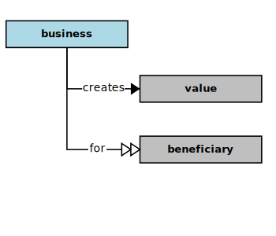

## Business

In the context of this [model](../domain-inventory.md), a [business][business]

<ul>
 <li><i>creates</i> a <a href="value.md">value</a> for some <a href="beneficiary.md">beneficiaries</a></li>
 <li> </li>
 <li> </li>
 <li> </li>
 <li> </li>
 <li> </li>
 <li> </li>
 <li> </li>
 <li> </li>
 <li> </li>
 <li> </li>
 <li> </li>
 <li> </li>
</ul>

### Discussion

A [business][business] tends (or intends) to create [value][value] for its shareholders
(if for-profit) and its constituents (those otherwise served or interested),
whether or not the [business][business] is conducted for profit.

[Value][Value] creation results from changes to (and [improvements][improvement] in the quality of) the world as effects.
Sometimes, the [value][value] of the changes results in monetary exchanges,
esp. when someone pays for the benefits received.
Sometimes, the [value][value] is intrinsic to the changes themselves.

<b>&sect; &sect; &sect;</b>

[activity]: activity.md
[activities]: activity.md
[business]: business.md
[businesses]: business.md
[component]: component.md
[components]: component.md
[developer]: developer.md
[developers]: developer.md
[dialog]: dialog.md
[dialogs]: dialog.md
[expector]: expector.md
[expectors]: expector.md
[feature]: feature.md
[features]: feature.md
[governor]: governor.md
[governors]: governor.md
[improvement]: improvement.md
[improvements]: improvement.md
[instrument]: instrument.md
[instruments]: instrument.md
[interface]: interface.md
[interfaces]: interface.md
[mission]: mission.md
[missions]: mission.md
[requestor]: requestor.md
[requestors]: requestor.md
[solution]: solution.md
[solutions]: solution.md
[stakeholder]: stakeholder.md
[stakeholders]: stakeholder.md
[value]: value.md
[values]: value.md
[vision]: vision.md
[visions]: vision.md

[qualities]: https://educery.dev/papers/modeling/quality-alignment/#business-quality-inventory
[improve]: improvement.md
[measurement]: https://educery.dev/papers/software-requirements/policy/values/#qualities-quantities
[improves]: improvement.md
[quality]: https://educery.dev/papers/modeling/quality-alignment/#business-quality-inventory
[measurable.way]: measurement.md
[valuable]: value.md
