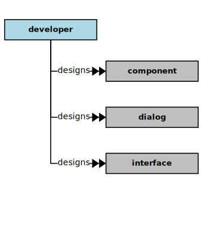
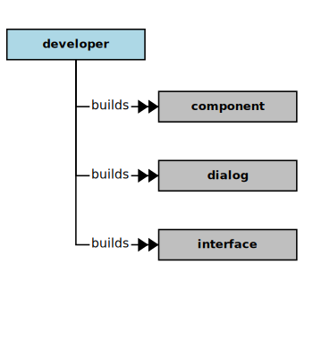
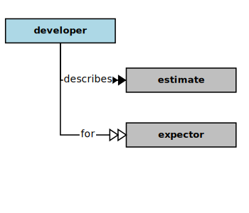
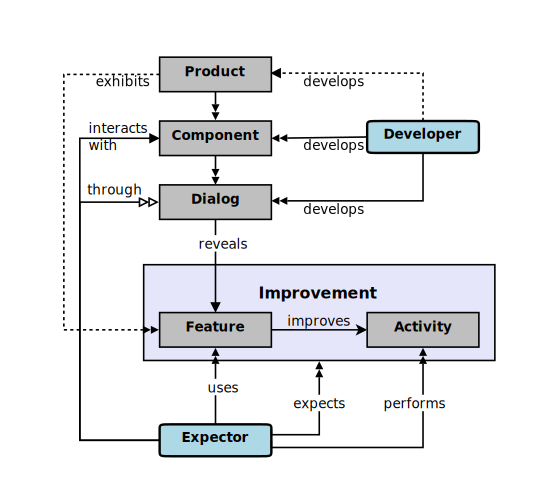

## Developer

In the context of this [model](../domain-inventory.md), a [developer][developer]

<ul>
 <li><i>designs</i> some <a href="component.md">components</a> and some <a href="dialog.md">dialogs</a> and some <a href="interface.md">interfaces</a></li>
 <li> </li>
 <li> </li>
 <li> </li>
 <li> </li>
 <li> </li>
 <li> </li>
 <li> </li>
 <li> </li>
 <li> </li>
 <li> </li>
 <li> </li>
 <li> </li>
 <li> </li>
 <li> </li>
 <li> </li>
</ul>

<ul>
 <li><i>builds</i> some <a href="component.md">components</a> and some <a href="dialog.md">dialogs</a> and some <a href="interface.md">interfaces</a></li>
 <li> </li>
 <li> </li>
 <li> </li>
 <li> </li>
 <li> </li>
 <li> </li>
 <li> </li>
 <li> </li>
 <li> </li>
 <li> </li>
 <li> </li>
 <li> </li>
 <li> </li>
 <li> </li>
 <li> </li>
</ul>

<ul>
 <li><i>tests</i> some <a href="component.md">components</a> and some <a href="dialog.md">dialogs</a> and some <a href="interface.md">interfaces</a></li>
 <li> </li>
 <li> </li>
 <li> </li>
 <li> </li>
 <li> </li>
 <li> </li>
 <li> </li>
 <li> </li>
 <li> </li>
 <li> </li>
 <li> </li>
 <li> </li>
 <li> </li>
 <li> </li>
 <li> </li>
</ul>

<ul>
 <li><i>describes</i> some <a href="estimate.md">estimates</a> for some <a href="expector.md">expectors</a></li>
 <li> </li>
 <li> </li>
 <li> </li>
 <li> </li>
 <li> </li>
 <li> </li>
 <li> </li>
 <li> </li>
 <li> </li>
 <li> </li>
 <li> </li>
 <li> </li>
</ul>

### Discussion

There are potentially several kinds of [developer][developer].
A [developer][developer] generally _**develops**_ (or guides, or manages the development of) software [solutions][solution].
Sometimes their responsibilities (and thus their interests) are combined in a single person or role within an organization.

| Kind | Interests and _Concerns_ |
| ---- | ------------------------ |
| Requirements Engineers | Needs, Usage, Knowledge, Behavior, Quality, Priority |
|  | _Intelligibility, Sufficiency, Coverage, Completeness, Alignment_ |
| Experience Designers | Usage, Knowledge, Behavior, Quality, Priority |
|  | _Intelligibility, Functionality, Usability, Sufficiency, Affordability, Efficiency_ |
| Software Engineers | Usage, Knowledge, Behavior, Quality, Priority |
|  | _Fitness, Simplicity, Flexibility, Adaptability, Modularity, Coverage, Completeness, Compatibility, Measurability, Efficiency_ |
| Quality Engineers | Usage, Knowledge, Behavior, Quality, Priority |
|  | _Sufficiency, Coverage, Completeness, Intelligibility, Alignment_ |

<b>&sect; &sect; &sect;</b>

[activity]: activity.md
[activities]: activity.md
[business]: business.md
[businesses]: business.md
[component]: component.md
[components]: component.md
[developer]: developer.md
[developers]: developer.md
[dialog]: dialog.md
[dialogs]: dialog.md
[expector]: expector.md
[expectors]: expector.md
[feature]: feature.md
[features]: feature.md
[governor]: governor.md
[governors]: governor.md
[improvement]: improvement.md
[improvements]: improvement.md
[instrument]: instrument.md
[instruments]: instrument.md
[interface]: interface.md
[interfaces]: interface.md
[mission]: mission.md
[missions]: mission.md
[requestor]: requestor.md
[requestors]: requestor.md
[solution]: solution.md
[solutions]: solution.md
[stakeholder]: stakeholder.md
[stakeholders]: stakeholder.md
[value]: value.md
[values]: value.md
[vision]: vision.md
[visions]: vision.md

[measurable.way]: measurement.md
[valuable]: value.md
