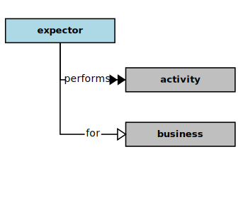

## Expector

In the context of this [model](../domain-inventory.md), an [expector][expector]

<ul>
 <li><i>expects</i> some <a href="improvement.md">improvements</a> in an <a href="activity.md">activity</a> for a <a href="business.md">business</a></li>
 <li> </li>
 <li> </li>
 <li> </li>
 <li> </li>
 <li> </li>
 <li> </li>
 <li> </li>
 <li> </li>
 <li> </li>
 <li> </li>
 <li> </li>
 <li> </li>
 <li> </li>
 <li> </li>
 <li> </li>
</ul>

<ul>
 <li><i>performs</i> some <a href="activity.md">activities</a> for a <a href="business.md">business</a></li>
 <li> </li>
 <li> </li>
 <li> </li>
 <li> </li>
 <li> </li>
 <li> </li>
 <li> </li>
 <li> </li>
 <li> </li>
 <li> </li>
 <li> </li>
 <li> </li>
</ul>

<ul>
 <li><i>uses</i> some <a href="feature.md">features</a> of a <a href="solution.md">solution</a></li>
 <li> </li>
 <li> </li>
 <li> </li>
 <li> </li>
 <li> </li>
 <li> </li>
 <li> </li>
 <li> </li>
 <li> </li>
 <li> </li>
 <li> </li>
 <li> </li>
</ul>

<ul>
 <li><i>triggers</i> some <a href="action.md">actions</a> on some <a href="component.md">components</a> through some <a href="dialog.md">dialogs</a></li>
 <li> </li>
 <li> </li>
 <li> </li>
 <li> </li>
 <li> </li>
 <li> </li>
 <li> </li>
 <li> </li>
 <li> </li>
 <li> </li>
 <li> </li>
 <li> </li>
 <li> </li>
 <li> </li>
 <li> </li>
</ul>

<ul>
 <li><i>views</i> some <a href="value.md">values</a> from some <a href="component.md">components</a> through some <a href="dialog.md">dialogs</a></li>
 <li> </li>
 <li> </li>
 <li> </li>
 <li> </li>
 <li> </li>
 <li> </li>
 <li> </li>
 <li> </li>
 <li> </li>
 <li> </li>
 <li> </li>
 <li> </li>
 <li> </li>
 <li> </li>
 <li> </li>
</ul>

<ul>
 <li><i>describes</i> some <a href="feature.md">features</a> for some <a href="developer.md">developers</a></li>
 <li> </li>
 <li> </li>
 <li> </li>
 <li> </li>
 <li> </li>
 <li> </li>
 <li> </li>
 <li> </li>
 <li> </li>
 <li> </li>
 <li> </li>
 <li> </li>
</ul>

### Discussion

There are potentially several kinds of [expector][expector].
An [expector][expector] generally expects a software [solution][solution] to simplify, permit, and improve the conduct of some [business][business] [activity][activity](s).
In some cases, a [business][business] [activity][activity] might not even be allowed, or might not be affordable without a software [solution][solution]
to automate some the associated processes, or to monitor them and collect measurements.

| Kind | Interests and _Concerns_ |
| ---- | ------------------------ |
| [Solution][Solution] Users | Features, Usage |
|  | _Simplicity, Effectiveness, Relevancy, Usefulness, Usability, Efficiency, Availability_ |
| [Solution][Solution] Customers | Features, Improvements |
|  | _Relevancy, Usefulness, Efficiency_ |
| [Solution][Solution] Installers | Installation, Configuration |
|  | _Relevancy, Affordability, Adaptability_ |
| [Solution][Solution] Operators | Operations, Monitoring |
|  | _Measurability, Affordability, Verifiability_ |
| Security Auditors | Security, Privacy |
|  | _Accountability, Measurability, Verifiability, Trustability_ |
| Finance Auditors | Accounting Practices (GAAP) |
|  | _Accountability, Measurability, Verifiability, Trustability_ |
| Compliance Auditors | Regulations, Compliance |
|  | _Accountability, Measurability, Verifiability, Trustability_ |

<b>&sect; &sect; &sect;</b>

[activity]: activity.md
[activities]: activity.md
[business]: business.md
[businesses]: business.md
[component]: component.md
[components]: component.md
[developer]: developer.md
[developers]: developer.md
[dialog]: dialog.md
[dialogs]: dialog.md
[expector]: expector.md
[expectors]: expector.md
[feature]: feature.md
[features]: feature.md
[governor]: governor.md
[governors]: governor.md
[improvement]: improvement.md
[improvements]: improvement.md
[instrument]: instrument.md
[instruments]: instrument.md
[interface]: interface.md
[interfaces]: interface.md
[mission]: mission.md
[missions]: mission.md
[requestor]: requestor.md
[requestors]: requestor.md
[solution]: solution.md
[solutions]: solution.md
[stakeholder]: stakeholder.md
[stakeholders]: stakeholder.md
[value]: value.md
[values]: value.md
[vision]: vision.md
[visions]: vision.md

[measurable.way]: measurement.md
[valuable]: value.md
