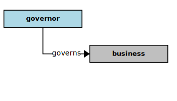
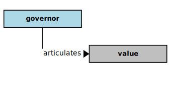
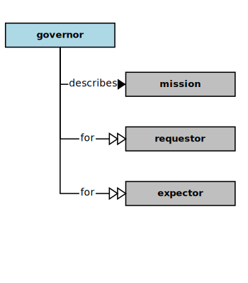
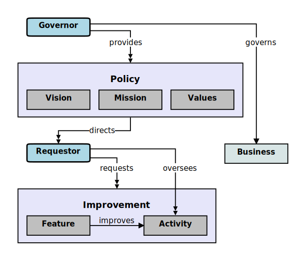

## Governor

In the context of this [model](../domain-inventory.md), a [governor][governor]

<ul>
 <li><i>governs</i> a <a href="business.md">business</a></li>
 <li> </li>
 <li> </li>
 <li> </li>
 <li> </li>
 <li> </li>
 <li> </li>
 <li> </li>
</ul>

<ul>
 <li><i>crafts</i> a <a href="vision.md">vision</a></li>
 <li> </li>
 <li> </li>
 <li> </li>
 <li> </li>
 <li> </li>
 <li> </li>
 <li> </li>
</ul>

<ul>
 <li><i>articulates</i> some <a href="value.md">values</a></li>
 <li> </li>
 <li> </li>
 <li> </li>
 <li> </li>
 <li> </li>
 <li> </li>
 <li> </li>
</ul>

<ul>
 <li><i>describes</i> a <a href="mission.md">mission</a> for some <a href="requestor.md">requestors</a> and some <a href="expector.md">expectors</a></li>
 <li> </li>
 <li> </li>
 <li> </li>
 <li> </li>
 <li> </li>
 <li> </li>
 <li> </li>
 <li> </li>
 <li> </li>
 <li> </li>
 <li> </li>
 <li> </li>
 <li> </li>
 <li> </li>
 <li> </li>
</ul>

### Discussion

There are several kinds of [governor][governor].
A [governor][governor] guides and governs a [business][business], providing direction and scope,
and establishing boundaries and limits.

| Kind | Interests and _Concerns_ |
| ---- | ------------------------ |
| Board Members | [Value][Value] Propositions, Ends Policies |
|  | _Relevancy, Accountability, Profitability, Value, Growth, Diversity_ |
| Corporate Officers | Ends Policies, Means Policies |
|  | _Value, Measurability, Accountability, Optimality_ |
| Shareholders | Value, Growth |
|  | _Value, Profitability, Growth, Accountability, Diversity_ |
| Government Regulators | Regulations, Compliance |
|  | _Measurability, Verifiability, Accountability, Trustability_ |

<b>&sect; &sect; &sect;</b>

[activity]: activity.md
[activities]: activity.md
[business]: business.md
[businesses]: business.md
[component]: component.md
[components]: component.md
[developer]: developer.md
[developers]: developer.md
[dialog]: dialog.md
[dialogs]: dialog.md
[expector]: expector.md
[expectors]: expector.md
[feature]: feature.md
[features]: feature.md
[governor]: governor.md
[governors]: governor.md
[improvement]: improvement.md
[improvements]: improvement.md
[instrument]: instrument.md
[instruments]: instrument.md
[interface]: interface.md
[interfaces]: interface.md
[mission]: mission.md
[missions]: mission.md
[requestor]: requestor.md
[requestors]: requestor.md
[solution]: solution.md
[solutions]: solution.md
[stakeholder]: stakeholder.md
[stakeholders]: stakeholder.md
[value]: value.md
[values]: value.md
[vision]: vision.md
[visions]: vision.md

[measurable.way]: measurement.md
[valuable]: value.md
