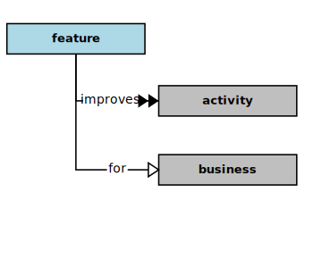

## Improvement

In the context of this [model](../domain-inventory.md), an [improvement][improvement]

<ul>
 <li><i>improves</i> some <a href="activity.md">activities</a> for a <a href="business.md">business</a></li>
 <li> </li>
 <li> </li>
 <li> </li>
 <li> </li>
 <li> </li>
 <li> </li>
 <li> </li>
 <li> </li>
 <li> </li>
 <li> </li>
 <li> </li>
 <li> </li>
</ul>

### Discussion

[Business][Business] [activities][activity] are most [valuable][valuable] when they are aligned
with specific and clearly formulated objectives.
Each [business][business] needs to have [mission][mission] and [vision][vision] statements that
focus on the ends the [business][business] intends to effect in the world.
To effect these ends, a [business][business] has processes (a series of [activities][activity]),
especially processes that operate on information (and so need information systems).
[Business][Business] information systems are products (with qualities) that provide
services (which also have qualities).
Information services support and improve [business][business] operations by
streamlining [business][business] processes (which have their own qualities).

An [improvement][improvement] changes the level of some measurable quality
of a [business][business] activity, or it may enable the conduct
of a [business][business] activity that would be difficult, unaffordable,
or impossible to conduct otherwise.
So, each [business][business] needs to determine its [business][business] process
and [improvement][improvement] objectives.
Based on these processing and [improvement][improvement] objectives,
a [business][business] needs to specify the product and service
qualities required of its information systems.

Ideally, the qualities of a software [solution][solution] and the services
it provides will be aligned with and supportive of the [business][business]
objectives expressed in the [business][business] [mission][mission] and [vision][vision] statements.
So, a [business][business] needs to clearly define its objectives (as ends)
and the means for achieving those objectives
(especially by using information systems) through the definition
of measurable changes in the levels of the qualities about which it is most concerned.

<b>&sect; &sect; &sect;</b>

[activity]: activity.md
[activities]: activity.md
[business]: business.md
[businesses]: business.md
[component]: component.md
[components]: component.md
[developer]: developer.md
[developers]: developer.md
[dialog]: dialog.md
[dialogs]: dialog.md
[expector]: expector.md
[expectors]: expector.md
[feature]: feature.md
[features]: feature.md
[governor]: governor.md
[governors]: governor.md
[improvement]: improvement.md
[improvements]: improvement.md
[instrument]: instrument.md
[instruments]: instrument.md
[interface]: interface.md
[interfaces]: interface.md
[mission]: mission.md
[missions]: mission.md
[requestor]: requestor.md
[requestors]: requestor.md
[solution]: solution.md
[solutions]: solution.md
[stakeholder]: stakeholder.md
[stakeholders]: stakeholder.md
[value]: value.md
[values]: value.md
[vision]: vision.md
[visions]: vision.md

[measurable.way]: measurement.md
[valuable]: value.md
