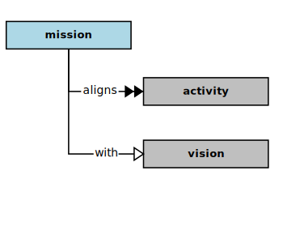
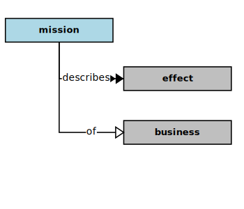

## Mission

In the context of this [model](../domain-inventory.md), a [mission][mission]

<ul>
 <li><i>aligns</i> some <a href="activity.md">activities</a> with a <a href="vision.md">vision</a></li>
 <li> </li>
 <li> </li>
 <li> </li>
 <li> </li>
 <li> </li>
 <li> </li>
 <li> </li>
 <li> </li>
 <li> </li>
 <li> </li>
 <li> </li>
 <li> </li>
</ul>

<ul>
 <li><i>describes</i> some <a href="effect.md">effects</a> of a <a href="business.md">business</a></li>
 <li> </li>
 <li> </li>
 <li> </li>
 <li> </li>
 <li> </li>
 <li> </li>
 <li> </li>
 <li> </li>
 <li> </li>
 <li> </li>
 <li> </li>
 <li> </li>
</ul>

### Discussion

A [mission][mission] statement can make a difference, especially when properly formulated.
A [mission][mission] statement should reflect the intended ends of an organization, rather than its means.

* _Ends versus Means._  An ends statement describes the difference an organization intends to make in the world, rather than merely describing what staff will be doing (the means) to effect those ends.
* _Effects versus Efforts._  A well-formed ends statement describes the results and effects to be achieved by staff, rather than their efforts and [activities][activity].

Ends are best expressed as effects that are qualitative (valuable) changes in the world.
Thus, ends are best expressed using adjectives that describe the intended effects,
i.e., a state (of being) to be achieved.
Descriptive adjectives especially indicate such states of being.

<b>&sect; &sect; &sect;</b>

[activity]: activity.md
[activities]: activity.md
[business]: business.md
[businesses]: business.md
[component]: component.md
[components]: component.md
[developer]: developer.md
[developers]: developer.md
[dialog]: dialog.md
[dialogs]: dialog.md
[expector]: expector.md
[expectors]: expector.md
[feature]: feature.md
[features]: feature.md
[governor]: governor.md
[governors]: governor.md
[improvement]: improvement.md
[improvements]: improvement.md
[instrument]: instrument.md
[instruments]: instrument.md
[interface]: interface.md
[interfaces]: interface.md
[mission]: mission.md
[missions]: mission.md
[requestor]: requestor.md
[requestors]: requestor.md
[solution]: solution.md
[solutions]: solution.md
[stakeholder]: stakeholder.md
[stakeholders]: stakeholder.md
[value]: value.md
[values]: value.md
[vision]: vision.md
[visions]: vision.md

[measurable.way]: measurement.md
[valuable]: value.md
