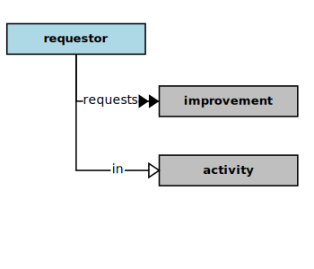
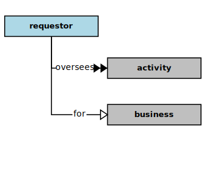
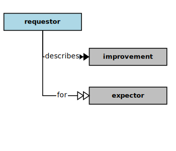

## Requestor

In the context of this [model](../domain-inventory.md), a [requestor][requestor]

<ul>
 <li><i>requests</i> some <a href="improvement.md">improvements</a> in an <a href="activity.md">activity</a></li>
 <li> </li>
 <li> </li>
 <li> </li>
 <li> </li>
 <li> </li>
 <li> </li>
 <li> </li>
 <li> </li>
 <li> </li>
 <li> </li>
 <li> </li>
 <li> </li>
</ul>

<ul>
 <li><i>oversees</i> some <a href="activity.md">activities</a> for a <a href="business.md">business</a></li>
 <li> </li>
 <li> </li>
 <li> </li>
 <li> </li>
 <li> </li>
 <li> </li>
 <li> </li>
 <li> </li>
 <li> </li>
 <li> </li>
 <li> </li>
 <li> </li>
</ul>

<ul>
 <li><i>describes</i> some <a href="improvement.md">improvements</a> for some <a href="expector.md">expectors</a></li>
 <li> </li>
 <li> </li>
 <li> </li>
 <li> </li>
 <li> </li>
 <li> </li>
 <li> </li>
 <li> </li>
 <li> </li>
 <li> </li>
 <li> </li>
 <li> </li>
</ul>

### Discussion

There are potentially several kinds of [requestor][requestor].
A [requestor][requestor] generally oversees and requests [improvements][improvement] in some [business][business] activity(s),
or they may have specific domain knowledge and expertise.
They also ensure that the conduct of [business][business] [activities][activity] remain
in alignment with the purposes of the [business][business],
esp. with its [mission][mission] and [vision][vision].

| Kind | Interests and _Concerns_ |
| ---- | ------------------------ |
| [Activity][Activity] Managers | Activities, Improvements |
|  | _Relevancy, Effectiveness, Efficiency, Reliability, Availability, Affordability_ |
| [Solution][Solution] Planners | Markets, Coverage |
|  | _Relevancy, Usefulness, Efficiency_ |
| [Solution][Solution] Marketers | Markets, Market Share |
|  | _Relevancy, Affordability, Adaptability_ |
| [Solution][Solution] Sponsors | Budgets, Expenses |
|  | _Measurability, Affordability, Verifiability_ |
| Domain Experts | Domain Coverage |
|  | _Sufficiency, Completeness, Cohesion, Correctness, Optimality_ |

<b>&sect; &sect; &sect;</b>

[activity]: activity.md
[activities]: activity.md
[business]: business.md
[businesses]: business.md
[component]: component.md
[components]: component.md
[developer]: developer.md
[developers]: developer.md
[dialog]: dialog.md
[dialogs]: dialog.md
[expector]: expector.md
[expectors]: expector.md
[feature]: feature.md
[features]: feature.md
[governor]: governor.md
[governors]: governor.md
[improvement]: improvement.md
[improvements]: improvement.md
[instrument]: instrument.md
[instruments]: instrument.md
[interface]: interface.md
[interfaces]: interface.md
[mission]: mission.md
[missions]: mission.md
[requestor]: requestor.md
[requestors]: requestor.md
[solution]: solution.md
[solutions]: solution.md
[stakeholder]: stakeholder.md
[stakeholders]: stakeholder.md
[value]: value.md
[values]: value.md
[vision]: vision.md
[visions]: vision.md

[measurable.way]: measurement.md
[valuable]: value.md
