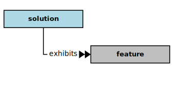
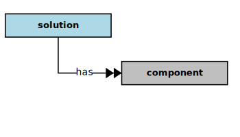

## Solution

In the context of this [model](../domain-inventory.md), a [solution][solution]

<ul>
 <li><i>exhibits</i> some <a href="feature.md">features</a></li>
 <li> </li>
 <li> </li>
 <li> </li>
 <li> </li>
 <li> </li>
 <li> </li>
 <li> </li>
</ul>

<ul>
 <li><i>has</i> some <a href="component.md">components</a></li>
 <li> </li>
 <li> </li>
 <li> </li>
 <li> </li>
 <li> </li>
 <li> </li>
 <li> </li>
</ul>

### Discussion

A software solution solves some specific (kinds of) problem(s).
Problems typically involve multiple elements from the real world (where they are situated).
Thus, a problem can usually be decomposed into several component elements, and these [components][component]
are often represented in the structure of the software solution.

Because software [solutions][solution] intend to enable or improve the conduct of some [business][business] [activities][activity],
most software [solutions][solution] provide some kind of user experience for collecting, manipulating, and
presenting information, whether using a desktop computer, a laptop computer, or a mobile device
(phone, tablet, etc.). Some of the software [components][component] surface these user experiences through [dialogs][dialog].
The [dialogs][dialog] engage users in conversations (of a kind) for
collecting, manipulating, and presenting information.

<b>&sect; &sect; &sect;</b>

[activity]: activity.md
[activities]: activity.md
[business]: business.md
[businesses]: business.md
[component]: component.md
[components]: component.md
[developer]: developer.md
[developers]: developer.md
[dialog]: dialog.md
[dialogs]: dialog.md
[expector]: expector.md
[expectors]: expector.md
[feature]: feature.md
[features]: feature.md
[governor]: governor.md
[governors]: governor.md
[improvement]: improvement.md
[improvements]: improvement.md
[instrument]: instrument.md
[instruments]: instrument.md
[interface]: interface.md
[interfaces]: interface.md
[mission]: mission.md
[missions]: mission.md
[requestor]: requestor.md
[requestors]: requestor.md
[solution]: solution.md
[solutions]: solution.md
[stakeholder]: stakeholder.md
[stakeholders]: stakeholder.md
[value]: value.md
[values]: value.md
[vision]: vision.md
[visions]: vision.md

[qualities]: https://educery.dev/papers/modeling/quality-alignment/#business-quality-inventory
[improve]: improvement.md
[measurement]: https://educery.dev/papers/software-requirements/policy/values/#qualities-quantities
[improves]: improvement.md
[quality]: https://educery.dev/papers/modeling/quality-alignment/#business-quality-inventory
[measurable.way]: measurement.md
[valuable]: value.md
