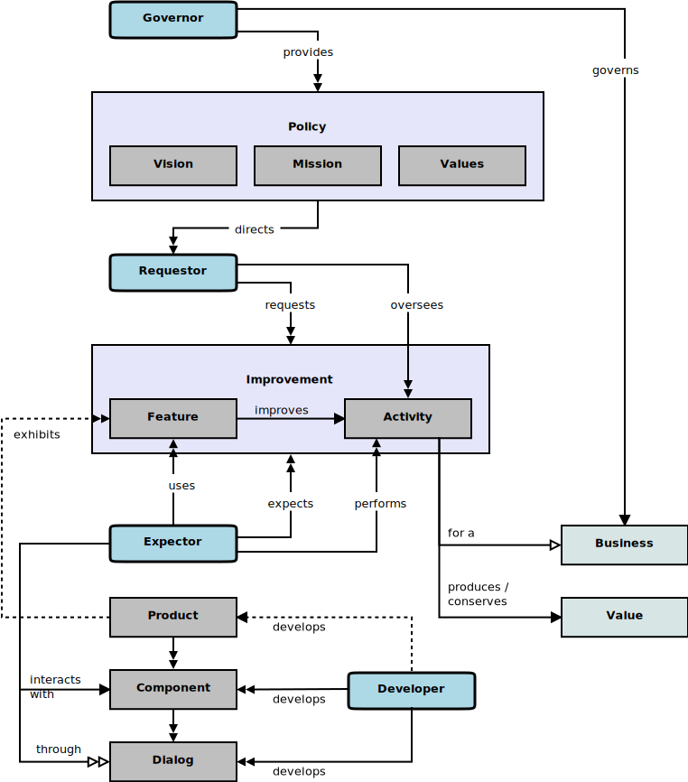

## Stakeholder

In the context of this [model](../domain-inventory.md), a [stakeholder][stakeholder]

<ul>
 <li><i>holds</i> some <a href="business.interest.md">business interests</a> and some <a href="quality.concern.md">quality concerns</a></li>
 <li> </li>
 <li> </li>
 <li> </li>
 <li> </li>
 <li> </li>
 <li> </li>
 <li> </li>
 <li> </li>
 <li> </li>
 <li> </li>
 <li> </li>
 <li> </li>
</ul>

### Discussion

Stakeholders include:

* [Governors][governor], who _govern_ a [business][business] and establish its policies
* [Requestors][requestor], who _oversee_ [business][business] [activities][activity] and _request_ [improvements][improvement] in those [activities][activity]
* [Expectors][expector], who _perform_ those [activities][activity] and expect a solution to improve those [activities][activity]
* [Developers][developer], who _develop_ software [solutions][solution] to _improve_ [business][business] [activities][activity]

<b>&sect; &sect; &sect;</b>

[activity]: activity.md
[activities]: activity.md
[business]: business.md
[businesses]: business.md
[component]: component.md
[components]: component.md
[developer]: developer.md
[developers]: developer.md
[dialog]: dialog.md
[dialogs]: dialog.md
[expector]: expector.md
[expectors]: expector.md
[feature]: feature.md
[features]: feature.md
[governor]: governor.md
[governors]: governor.md
[improvement]: improvement.md
[improvements]: improvement.md
[instrument]: instrument.md
[instruments]: instrument.md
[interface]: interface.md
[interfaces]: interface.md
[mission]: mission.md
[missions]: mission.md
[requestor]: requestor.md
[requestors]: requestor.md
[solution]: solution.md
[solutions]: solution.md
[stakeholder]: stakeholder.md
[stakeholders]: stakeholder.md
[value]: value.md
[values]: value.md
[vision]: vision.md
[visions]: vision.md

