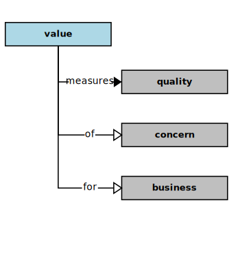
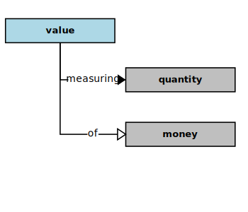

## Value

In the context of this [model](../domain-inventory.md), a [value][value]

<ul>
 <li><i>measures</i> a <a href="quality.md">quality</a> of a <a href="concern.md">concern</a> for a <a href="business.md">business</a></li>
 <li> </li>
 <li> </li>
 <li> </li>
 <li> </li>
 <li> </li>
 <li> </li>
 <li> </li>
 <li> </li>
 <li> </li>
 <li> </li>
 <li> </li>
 <li> </li>
 <li> </li>
 <li> </li>
 <li> </li>
</ul>

<ul>
 <li><i>measuring</i> a <a href="quantity.md">quantity</a> of a <a href="money.md">money</a></li>
 <li> </li>
 <li> </li>
 <li> </li>
 <li> </li>
 <li> </li>
 <li> </li>
 <li> </li>
 <li> </li>
 <li> </li>
 <li> </li>
 <li> </li>
 <li> </li>
</ul>

### Discussion

A [business][business] produces [value][value] for its beneficiaries through its [activities][activity].
Some [activities][activity] of a [business][business] may save its beneficiaries time or money or both.
Whether directly or indirectly, the purpose of a [business][business] and its [activities][activity] in the world are to provide a valuable benefit.

The degree to which a [business][business] produces such benefits can be measured, and thereby motivates the funding of its [activities][activity].
Also, [business][business] [activities][activity] themselves have qualities that can be measured and potentially improved.
Those [activities][activity] that are [mission][mission] critical will especially warrant address for [improvement][improvement].

<b>&sect; &sect; &sect;</b>

[activity]: activity.md
[activities]: activity.md
[business]: business.md
[businesses]: business.md
[component]: component.md
[components]: component.md
[developer]: developer.md
[developers]: developer.md
[dialog]: dialog.md
[dialogs]: dialog.md
[expector]: expector.md
[expectors]: expector.md
[feature]: feature.md
[features]: feature.md
[governor]: governor.md
[governors]: governor.md
[improvement]: improvement.md
[improvements]: improvement.md
[instrument]: instrument.md
[instruments]: instrument.md
[interface]: interface.md
[interfaces]: interface.md
[mission]: mission.md
[missions]: mission.md
[requestor]: requestor.md
[requestors]: requestor.md
[solution]: solution.md
[solutions]: solution.md
[stakeholder]: stakeholder.md
[stakeholders]: stakeholder.md
[value]: value.md
[values]: value.md
[vision]: vision.md
[visions]: vision.md

[measurable.way]: measurement.md
[valuable]: value.md
