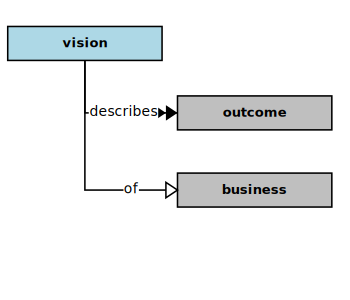

## Vision

In the context of this [model](../domain-inventory.md), a [vision][vision]

<ul>
 <li><i>describes</i> some <a href="outcome.md">outcomes</a> of a <a href="business.md">business</a></li>
 <li> </li>
 <li> </li>
 <li> </li>
 <li> </li>
 <li> </li>
 <li> </li>
 <li> </li>
 <li> </li>
 <li> </li>
 <li> </li>
 <li> </li>
 <li> </li>
</ul>

### Discussion

A [vision][vision] statement succinctly expresses a durable purpose,
the quality concerns congruent with that purpose,
and potential outcome(s) with respect to that purpose and those concerns.
By remaining focused on outcomes (as ends), a [vision][vision]
statement provides the basis for aligning a [mission][mission] with its purpose.
As with [mission][mission] statements, a [vision][vision] statement needs to focus on:

* _Ends versus Means._  An ends statement describes the difference an organization intends to make in the world, rather than merely describing what staff will be doing (the means) to effect those ends.
* _Effects versus Efforts._  A well-formed ends statement describes the results and effects to be achieved by staff, rather than their efforts and [activities][activity].

Hence, an ends statement should not include verbs, which are
indicative of [activities][activity] (efforts) rather than effects.
However, where a [mission][mission] statement will tend to include
scope and situate that within a [value][value] chain,
a [vision][vision] statement will more often tend toward more
expansiveness, or simply leave out such scoping,
as the intended scope may ultimately be global, or impact
all partners, suppliers, and customers within a [value][value] chain.

<b>&sect; &sect; &sect;</b>

[activity]: activity.md
[activities]: activity.md
[business]: business.md
[businesses]: business.md
[component]: component.md
[components]: component.md
[developer]: developer.md
[developers]: developer.md
[dialog]: dialog.md
[dialogs]: dialog.md
[expector]: expector.md
[expectors]: expector.md
[feature]: feature.md
[features]: feature.md
[governor]: governor.md
[governors]: governor.md
[improvement]: improvement.md
[improvements]: improvement.md
[instrument]: instrument.md
[instruments]: instrument.md
[interface]: interface.md
[interfaces]: interface.md
[mission]: mission.md
[missions]: mission.md
[requestor]: requestor.md
[requestors]: requestor.md
[solution]: solution.md
[solutions]: solution.md
[stakeholder]: stakeholder.md
[stakeholders]: stakeholder.md
[value]: value.md
[values]: value.md
[vision]: vision.md
[visions]: vision.md

[measurable.way]: measurement.md
[valuable]: value.md
